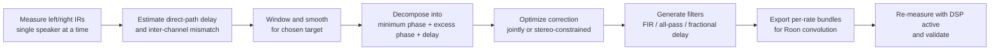
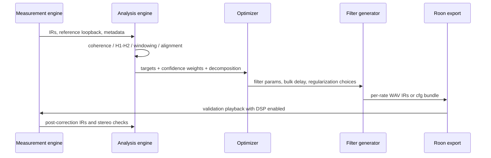

# Digital Room Correction for Excess Phase and Stereo Phase Alignment

## Executive summary

If your magnitude correction is already working, the next hard problem is not “flatten the remaining phase,” but “separate what is physically meaningful and stably correctable from what is measurement-, position-, or interference-dependent.” In a stereo room-correction toolchain, the useful decomposition is usually

\[
H_c(\omega)=H_{\min,c}(\omega)\,A_c(\omega)\,e^{-j\omega \tau_{0,c}}
\]

for each channel \(c\in\{L,R\}\), where \(H_{\min}\) is the minimum-phase component implied by the measured magnitude, \(A\) is an all-pass term carrying excess phase, and \(e^{-j\omega \tau_0}\) is bulk delay. This decomposition matters because stable causal inversion is straightforward for minimum-phase behavior, but not for zeros outside the unit circle or for strongly position-dependent nonminimum-phase room interference. Classic room-equalization literature explicitly warns that high-Q, nonminimum-phase room-loudspeaker-listener behavior imposes practical limits on full inversion, and perceptual studies show that phase/excess-phase errors cannot always be ignored. citeturn19view3turn28view0turn16view7turn30view0turn16view4

For implementation, the most robust architecture is usually layered rather than monolithic. First, estimate pure delay and inter-channel timing from the direct sound. Second, reconstruct a minimum-phase reference from the measured magnitude and define excess phase relative to it. Third, correct only the part of excess phase that is stable across repetitions, has adequate coherence, and falls in bands where latency and pre-ringing remain acceptable. Fourth, preserve stereo relationships by optimizing the two channels jointly, or at least by constraining inter-channel phase differences while fitting each channel. Limited-band group-delay equalization often outperforms full-band correction because it reduces filter length, latency, and pre-ringing while preserving most audible benefit. citeturn19view2turn34view0turn17view4turn17view1turn16view15turn12search0

For measurement, exponentially swept-sine measurements with a loopback reference should be your default. Sweeps are robust to acoustic noise and loudspeaker nonlinearity; Farina’s ESS deconvolution also separates harmonic distortion products in time, which is a major reason sweeps displaced MLS for many acoustical tasks. MLS remains useful, but it relies on periodic/circular assumptions, is commonly recovered by cross-correlation, and is more sensitive to nonlinearity and synchronization issues. citeturn22view0turn22view1turn22view2turn22view3turn5search0turn4search4

For stereo systems, the biggest implementation mistake is to phase-correct each speaker independently without protecting the relative phase seen at the listening position. Distance mismatch, crossover phase, subwoofer alignment, and speaker-room asymmetry all alter phantom-center stability and crossover summation. Direct-sound alignment, coherence-weighted fitting, and separate handling of sub/main integration are more important than globally flattening measured phase traces. If imaging is a primary objective, point-microphone transfer measurements are not enough: binaural measurements capture the ear-specific two-by-two loudspeaker-to-ear transfer behavior that underlies interaural cues and crosstalk. citeturn16view10turn31view0turn6search1turn7search8turn9search12

For Roon-streamed stereo, the practical constraint is packaging and sample-rate hygiene rather than algorithmic novelty. Roon loads externally designed convolution filters from zipped WAV or convolver-style configuration bundles, chooses the closest match by channel layout and sample rate, and will resample the filter when no exact-rate version is present. That means your export layer should emit per-sample-rate filter banks, preserve latency metadata internally, and leave headroom for DSP gain growth. Roon’s Speaker Setup can handle distance and polarity in a bit-perfect way, but it is not a substitute for measured excess-phase correction. citeturn16view8turn19view10turn16view10turn16view11turn19view9

## Technical background and math

With the standard discrete-time convention, a measured transfer function is

\[
H(e^{j\omega}) = |H(\omega)|e^{j\phi(\omega)}.
\]

The phase delay is

\[
\tau_p(\omega)= -\frac{\phi(\omega)}{\omega},
\]

and the group delay is

\[
\tau_g(\omega)= -\frac{d\phi(\omega)}{d\omega}.
\]

Phase delay is the delay experienced by a sinusoidal component; group delay is the delay experienced by the envelope of a narrowband packet around frequency \(\omega\). For linear-phase systems, \(\phi(\omega)=-\alpha\omega\), so phase delay and group delay coincide and equal the same constant delay. citeturn19view0turn19view1

A causal stable filter is minimum phase if all of its zeros lie inside the unit circle, maximum phase if all of its zeros lie outside the unit circle, and mixed phase if it has zeros on both sides. Minimum-phase systems have the smallest delay compatible with a given magnitude response; in the time domain, they concentrate energy early in the impulse response. Maximum-phase and all-pass factors preserve magnitude while redistributing phase and temporal energy. The minimum-phase response associated with a log-magnitude spectrum is linked to that magnitude by a Hilbert-transform relationship, which is the core reason minimum-phase reconstruction from magnitude alone is possible. citeturn28view0turn28view2turn19view3turn19view4

For implementation, it is helpful to separate bulk delay from “shape” phase. Let

\[
\phi(\omega)=\phi_{\min}(\omega)+\phi_{\mathrm{ap}}(\omega)-\omega\tau_0,
\]

where \(\phi_{\min}\) is the minimum-phase angle implied by \(|H(\omega)|\), \(\phi_{\mathrm{ap}}\) is the all-pass or excess-phase term, and \(\tau_0\) is pure delay. Then the excess phase can be defined as

\[
\phi_{\mathrm{ex}}(\omega) = \operatorname{unwrap}\!\big(\phi(\omega)-\phi_{\min}(\omega)+\omega\tau_0\big),
\]

and the corresponding group-delay decomposition is additive:

\[
\tau_g(\omega)=\tau_{g,\min}(\omega)+\tau_{g,\mathrm{ex}}(\omega)+\tau_0.
\]

This is not just bookkeeping: delay should usually be corrected first with integer/fractional delay, because using a long FIR to absorb what is essentially a geometric arrival-time mismatch wastes latency budget. citeturn19view3turn28view0turn27view0turn26view3

All-pass decomposition gives the mathematical bridge from mixed-phase measurements to correctable phase-only filters. Kabal shows that a non-minimum-phase factor can be rewritten as a minimum-phase factor times an all-pass factor, and that an all-pass filter has unity magnitude response while contributing only phase and group delay. For stable causal all-pass sections with poles inside the unit circle, the group delay is positive and can be summed across sections, making all-pass cascades natural phase/alignment correctors. citeturn28view0turn27view0turn27view4

In rooms, however, correctability is limited by physics and robustness. Fielder’s classic AES analysis argues that the high-Q, nonminimum-phase character of room-loudspeaker-listener transfer functions from wave interference severely constrains complete equalization. More recent work on single- and multi-loudspeaker inversion reaches the same conclusion from a systems viewpoint: if zeros lie inside and outside the unit circle, perfect stable causal inversion is not available in the single-channel case, while multichannel inverse methods can help but are sensitive to common zeros and modeling errors and therefore require regularization. citeturn16view7turn36view0turn31view2

One practical consequence is that “measured phase” is not a single design target. There is a speaker-intrinsic component, a geometry/delay component, a crossover/sub integration component, and a room-interference component. Treating all of them as if they were equally correctable leads to overfitting, long filters, and pre-ringing. Bean and Craven already distinguished between linear and minimum-phase corrections in room work, and later loudspeaker studies show that full-band group-delay equalization can produce significant impulse-response reshaping and pre-ringing, while limited-band equalization is often the better engineering compromise. citeturn30view2turn17view4turn17view1turn16view15

## Measurement and estimation methods

The measurement primitive is the impulse response \(h[n]\), linked to input \(x[n]\) and output \(y[n]\) by convolution:

\[
y[n]=h[n]*x[n].
\]

Once \(h[n]\) is measured, magnitude, phase, group delay, coherence, arrival time, crossover interaction, and stereo asymmetry all become observable. Swept-sine methods dominate modern acoustical practice because they provide broadband excitation, controllable energy, high SNR, and robustness against nonlinearity. Pyfar’s measurement tutorial explicitly formulates the sweep measurement this way and recommends a direct loopback reference to remove measurement-chain effects; Farina and Müller/Massarani explain why sweep methods are typically preferable to MLS for real loudspeaker/room work. citeturn22view3turn23view6turn22view0turn22view1turn4search4

For ESS, the recorded response is deconvolved with an equalized, time-reversed inverse filter. Farina’s presentation describes this as a “time reversal mirror” technique: convolving the measured signal with the time-reversed sweep, after proper equalization for the non-white sweep spectrum, produces an impulse-response sequence in which the linear IR is separated in time from harmonic distortion orders. This separation is a major implementation advantage because it lets you inspect whether poor coherence or weird phase is a room issue or a loudspeaker nonlinearity issue. citeturn22view0turn22view1

In the frequency domain, deconvolution is simply

\[
Y[k]=H[k]X[k], \qquad H[k]=\frac{Y[k]}{X[k]}.
\]

The caveat is that direct inversion of \(X[k]\) boosts out-of-band noise and deep spectral nulls. Pyfar’s example therefore recommends regularized spectrum inversion, which is directly relevant to room correction: the same regularization idea should be used whenever magnitude notches or low-coherence regions would otherwise force extreme inverse effort. citeturn23view0

MLS and related pseudo-random methods recover the response by correlation or equivalent convolution with a reversed sequence. Their strength is efficient recovery of periodic impulse responses, but the sequence length must be chosen to avoid time aliasing, and real systems only approximate the circular-convolution assumption. Practical MLS use often requires two sequence periods and careful synchronization, and the method is more fragile under loudspeaker distortion and time variance than sweeps. citeturn22view2turn5search0turn4search4

The measurement signal choice can therefore be implemented as follows. The comparison below synthesizes the measurement literature and examples already cited. citeturn22view0turn22view1turn22view2turn22view3turn5search0turn4search4

| Method | Core recovery step | Strengths | Weaknesses | Best use in your tool |
|---|---|---|---|---|
| Direct impulse / transient | Read IR directly | Conceptually simple | Poor SNR, hard to control bandwidth/level | Rarely useful except sanity checks |
| MLS / pseudo-random | Cross-correlation or equivalent deconvolution | Efficient, classic two-channel TF estimation | Sensitive to nonlinearity, time variance, circular-alias assumptions, synchronization | Fast lab measurements when the chain is well-controlled |
| ESS / logarithmic sine sweep | Inverse-filter deconvolution | High SNR, robust to distortion, separates harmonic orders, adjustable sweep length/band | Longer measurement time than MLS, inverse filter/equalization required | Default for loudspeaker/room/stereo phase work |
| Segmented/layered ESS | Multiple sweeps with different lengths/bands | Better low-frequency resolution without excessive total time | More complex orchestration and bookkeeping | Subwoofer and low-frequency mode work |

Windowing is not an optional post-step; it is part of what the phase target means. If you gate tightly around the direct sound, you are estimating speaker/geometry phase and suppressing late reflections. If you use a long room window, you are measuring the full loudspeaker-room-listener response, which is what you want for subwoofer integration and low-frequency room behavior. Pyfar’s example explicitly pads zeros to allow system decay and then windows the measured IR to shorten and post-process it; Audyssey’s complex-smoothing work argues for high low-frequency resolution and lower high-frequency fitting resolution to avoid overfitting. citeturn23view2turn23view6turn31view0

A practical stereo protocol is to measure at least three sets of responses: left speaker alone, right speaker alone, and both speakers together. For each single-speaker measurement, also record a loopback reference channel so that interface latency and soundcard phase are removed before you estimate inter-channel differences. For robustness in the low end, add a small cluster or random multi-point set; Pedersen’s AES work reported that measurements from at least four random positions can robustly estimate room sound-field energy, which is valuable if you want your low-frequency target to generalize beyond a single point. citeturn22view3turn31view1

Channel time alignment should be estimated from the direct sound, not from the full reverberant response. A robust procedure is: gate around the first arrival, estimate a coarse delay by cross-correlation or GCC-PHAT, refine to sub-sample resolution by local interpolation around the peak or by fitting a linear phase slope to the direct-path transfer-function ratio. GCC-PHAT is explicitly designed to estimate delay from the phase transform of the cross-power spectrum and is a good fallback when amplitude coloration is strong. citeturn24search0turn34view0

Coherence tells you whether a phase estimate is worth trusting. The ordinary coherence function is

\[
\gamma^2(\omega)=\frac{|S_{xy}(\omega)|^2}{S_{xx}(\omega)S_{yy}(\omega)},
\]

and ranges from zero to one. NI’s documentation states that it measures how much response energy is correlated with stimulus energy; low values indicate interference, noise, or other sources. Brüel & Kjær’s dual-channel FFT review adds an important acoustics-specific interpretation: insufficient time record length relative to the impulse response and leakage around narrow resonances can also depress coherence. In other words, low coherence does not just mean “noisy measurement”; it can also mean “your window, resolution, or excitation is incompatible with the local room dynamics.” citeturn19view2turn34view0

For transfer-function estimation, B&K gives the classical estimators

\[
H_1(\omega)=\frac{S_{yx}(\omega)}{S_{xx}(\omega)},\qquad
H_2(\omega)=\frac{S_{yy}(\omega)}{S_{xy}(\omega)}.
\]

Their guidance is still useful: \(H_1\) is preferred when output noise or uncorrelated additional inputs dominate, while \(H_2\) is preferable when input noise or leakage around resonance peaks dominates. In most room-correction measurements with a clean reference channel and microphone noise on the output side, \(H_1\) is the more natural default, but your analysis layer should compute both and expose disagreement as a diagnostic. citeturn34view0

## Excess-phase estimation and correction algorithms

The algorithm families below synthesize the cited minimum-phase/all-pass theory, cepstral methods, FIR/IIR equalization literature, and numerical implementation notes. Complexity and real-time suitability are engineering inferences from the filter structures and reported methods, not verbatim claims from any single source. citeturn19view3turn28view0turn29view0turn29view3turn29view4turn19view5turn17view4turn26view3

| Technique | What it estimates or designs | Pros | Cons | Design complexity | Runtime latency | Real-time suitability |
|---|---|---|---|---|---|---|
| Minimum-phase reconstruction via Hilbert transform | \(\phi_{\min}\) from \(|H|\) | Fast, direct, no root finding, good baseline for excess-phase definition | Sensitive to unsmoothed deep notches and noisy log-magnitude | Low | None by itself | Excellent |
| Homomorphic / cepstral decomposition | Minimum-phase and anti-causal cepstral parts | Handles mixed phase; conceptually clean; standard tool for MP/EP separation | Requires careful phase unwrapping, FFT size choice, and alias-control | Low–medium | None by itself | Excellent offline, good online analysis |
| Iterative cepstral flattening | Minimum-phase extraction plus residual mixed-phase monitoring | More numerically controlled than naive one-shot decomposition | Iterative; still sensitive to measurement errors | Medium | None by itself | Good offline |
| Root reflection / explicit all-pass factorization | \(H = H_{\min}A_{\mathrm{ap}}\) from zeros | Exact for tractable FIR/IIR models; direct all-pass sections | Root finding for long noisy FIRs can be numerically brittle | Medium–high | None by itself | Mostly offline |
| FIR full-band phase inverse | Complex target \(D(\omega)\) over broad band | Powerful, easy to combine with existing magnitude correction | Longer filters, latency, preringing, strong position sensitivity | Medium | High, set by tap count | Good only if latency budget is large |
| FIR limited-band group-delay equalizer | Flatten \(\tau_g\) only in selected bands | Lower latency and less preringing than full-band; strong practical compromise | Leaves uncorrected bands; needs target-band selection | Medium | Medium | Very good |
| IIR all-pass equalizer | Fit group delay / excess phase with unity-gain sections | Low runtime cost; magnitude preserved; ideal for alignment and crossover work | Nonconvex fitting; only adds delay; exact matching may need many sections | Medium | Low | Excellent |
| Fractional-delay FIR or Thiran all-pass | Sub-sample delay alignment | Best first step for speaker-distance mismatch and sub/main timing | Corrects only bulk delay, not complex excess phase | Low | Very low | Excellent |

### Excess-phase estimation

The simplest excess-phase estimator is “minimum-phase reconstruction plus subtraction.” Start from a measured, windowed transfer function \(H(\omega)\). Smooth the log-magnitude to suppress very narrow notches and low-coherence irregularities. Compute

\[
\phi_{\min}(\omega) \approx -\mathcal{H}\{\ln |H(\omega)|\},
\]

with a sign convention consistent with your Fourier transform. Then unwrap the measured phase, estimate bulk delay \(\tau_0\) from the direct path or from the best-fit linear slope, and define

\[
\phi_{\mathrm{ex}}(\omega)=\operatorname{unwrap}\big(\phi(\omega)-\phi_{\min}(\omega)+\omega\tau_0\big).
\]

This method is the right baseline because it is transparent, fast, and directly connected to the minimum-phase theory described by Makivirta et al., Kabal, and Damera-Venkata/Evans. citeturn19view3turn28view0turn29view3turn29view5

The cepstral formulation is more robust when you need explicit causal versus anti-causal separation. If \(\hat X(\omega)=\ln H(\omega)\), the inverse transform of \(\hat X\) is the complex cepstrum \(c[n]\). Kabal notes that the complex cepstrum is causal if and only if the original sequence is minimum phase. In practice, that means you can apply a cepstral lifter that keeps causal coefficients to reconstruct the minimum-phase component and anti-causal coefficients to reconstruct the maximum-phase/all-pass residual. SciPy’s `minimum_phase` documentation uses exactly these Hilbert and homomorphic families, and it explicitly notes that the FFT length matters because the complex cepstrum is being estimated numerically. citeturn29view0turn29view4turn29view5

Radlovic and Kennedy’s room-acoustics paper is especially relevant for excess-phase tooling because it presents an iterative minimum-phase/all-pass decomposition that repeatedly extracts a minimum-phase component while flattening the remaining magnitude. The useful implementation lesson is not only the algorithm itself, but the reason for using it: direct homomorphic decomposition of room responses can be numerically delicate, so an iterative scheme that monitors the residual mixed-phase component can be easier to control and debug. citeturn19view5turn29view1

Explicit all-pass factorization is attractive when you already have a trusted FIR or rational model. If a zero lies outside the unit circle, reflect it inside to obtain a corresponding minimum-phase zero, and assign the difference to an all-pass section. Kabal gives the stable causal all-pass form and shows that it has constant magnitude. This route is algebraically clean and ideal for parametric all-pass fitting, but for long measured FIRs it can be numerically ugly because root finding on noisy high-order polynomials is exactly the kind of operation that Damera-Venkata and others tried to avoid with Hilbert/cepstral algorithms. citeturn28view0turn27view0turn13search0turn29view3

### Correction strategies

A full-band FIR inverse gives you the most freedom because you can target any desired complex response, including your already-corrected magnitude combined with a preferred phase law. But the cost is latency and pre-ringing. Makivirta et al. show that broad group-delay equalization can produce strong changes in the impulse response and visible preringing, and the recent AES paper on FIR phase-correction optimization explicitly frames the problem as a tradeoff between phase correction and time-domain side effects such as pre-ringing and coloration. citeturn17view4turn12search0

A limited-band FIR equalizer is often the best engineering answer. The Aalto thesis and the 2018 JAES loudspeaker paper both report that restricting group-delay equalization to a selected band, rather than the full audio range, can produce better practical behavior with shorter filters and smaller impulse-response changes. In the cited example, excluding very low frequencies reduced required filter length from roughly 2048 to 1024 samples while still matching the desired group-delay target well. This is directly relevant to stereo room correction because the low end is where room dominance and position sensitivity are at their worst. citeturn17view4turn17view1turn17view2

IIR all-pass equalizers are ideal when the goal is phase alignment rather than magnitude inversion. They preserve magnitude exactly, run with very low CPU cost, and are structurally aligned with crossover and subwoofer timing problems. Kabal’s report summarizes why all-pass sections are the standard delay-equalization tool, and the EUSIPCO work on IIR group-delay equalization shows how all-pass sections can be initialized and then tuned by optimization. In practice, this means an all-pass path is your low-latency phase corrector for crossover alignment, sub/main integration, and moderate excess-phase flattening in selected bands. citeturn27view4turn26view1turn18view7

Fractional delay belongs in the architecture as a separate primitive, not as a side effect of a more general phase corrector. Välimäki and Laakso’s review treats fractional-delay filters as the basic element for fine timing alignment and compares FIR and all-pass realizations; Julius Smith’s material highlights Lagrange FIR and Thiran-style all-pass approaches as the canonical design families. In a stereo tool, this primitive should handle bulk geometric mismatch and fine sub-sample alignment before any attempt at broadband excess-phase correction. citeturn26view3turn11search3turn11search5

### Objective functions and regularization

For phase correction, the most useful objective is usually not “match absolute phase everywhere,” but a weighted sum of four terms:

\[
J = J_{\mathrm{phase}} + \lambda_{\mathrm{gd}}J_{\mathrm{gd}} + \lambda_{\mathrm{lat}}J_{\mathrm{lat}} + \lambda_{\mathrm{reg}}J_{\mathrm{reg}}.
\]

A practical choice is

\[
J_{\mathrm{phase}}
=
\sum_i w_i \left|\operatorname{wrap}\!\left(\phi_{\mathrm{eq}}(\omega_i)+\phi_{\mathrm{meas}}(\omega_i)-\phi_{\mathrm{target}}(\omega_i)\right)\right|^2
\]

or, more robustly, complex-domain least squares on the target unit-magnitude response. Group-delay flattening can be expressed as

\[
J_{\mathrm{gd}}
=
\sum_i w_i \left(\tau_{g,\mathrm{eq+meas}}(\omega_i)-\tau_{g,\mathrm{target}}(\omega_i)\right)^2.
\]

Frequency weights \(w_i\) should combine at least coherence, band importance, and correction confidence; for example \(w_i = \gamma^p(\omega_i)\,w_{\mathrm{band}}(\omega_i)\,w_{\mathrm{stereo}}(\omega_i)\). This directly incorporates the measurement-quality interpretation of coherence and the perceptually motivated low-versus-high-frequency fitting asymmetry emphasized in complex-smoothing work. citeturn19view2turn31view0turn16view3

Regularization should be frequency-dependent, not a single scalar everywhere. Schepker et al. explicitly use frequency-dependent regularization and group-delay compensation to reduce comb-filtering artifacts in least-squares equalization, and the same idea ports well to stereo room correction: penalize aggressive equalizer effort where the measured response is dominated by leakage, cancellation notches, or low-coherence structure. A useful family is

\[
J_{\mathrm{reg}}
=
\sum_i \rho(\omega_i)\,|G(\omega_i)|^2
+
\eta \|D_2 g\|_2^2
+
\mu \|W_{\mathrm{early}}g\|_2^2,
\]

where \(\rho(\omega)\) rises in low-confidence bands, \(D_2\) penalizes rapid tap-to-tap roughness, and \(W_{\mathrm{early}}\) penalizes excessive early-tap energy to suppress pre-ringing. The last term is especially appropriate when you allow FIR phase correction. citeturn36view0turn12search0

Stereo-aware objectives need an additional coupling term. If \(H_L\) and \(H_R\) are the left/right corrected transfer functions, define the inter-channel transfer ratio at the listening point as

\[
R_{LR}(\omega)=\frac{H_R(\omega)}{H_L(\omega)}.
\]

Then constrain or penalize deviation from a target relative phase law:

\[
J_{\mathrm{stereo}}
=
\sum_i w^{(st)}_i
\left|
\operatorname{wrap}\!\left(
\angle R_{LR}(\omega_i)-\angle R_{LR,\mathrm{target}}(\omega_i)
\right)
\right|^2.
\]

This protects phantom-center and imaging behavior while still allowing per-channel correction. The target is usually zero relative phase after direct-sound alignment in the shared localization band, with exceptions where intentional asymmetry is present. citeturn16view10turn31view1

## Stereo-specific analysis and workflow

Stereo phase work should explicitly separate **arrival-time alignment**, **relative phase alignment**, and **room correction**. Arrival-time alignment is mostly geometry: if one speaker is farther away, the phantom center will shift and the soundstage will not be perceived as centered. Roon’s own Speaker Setup documentation uses exactly this example and recommends distance adjustment first. That means your phase tool should estimate and remove inter-channel delay before fitting excess phase, because otherwise the optimizer burns FIR length on something that a fractional delay could solve almost perfectly. citeturn16view10turn26view3

Once direct-path timing is aligned, the next stereo problem is **relative phase through the crossover and localization bands**. This is where “correct each speaker independently” becomes dangerous. Microsoft’s AES abstract on perceptually tuned room correction explicitly identifies imaging restoration and equalization of first-attack response as separate goals, and that is the correct mental model here: preserve the first-arrival inter-channel relationship, then only correct per-channel excess phase insofar as it does not destabilize the stereo image. citeturn31view1

Subwoofer integration should be handled as its own phase-alignment problem. AES work on PA subwoofer alignment notes that it is not only a distance issue because the crossover itself modifies phase, and Vanderkooy’s room-correction session summary shows why multiple low-frequency sources, delays, gains, and phase adjustments matter for room-mode control. In a two-channel domestic system, the practical sequence is: measure mains-only, sub-only, and combined; align direct/bulk delay; optimize overlap-band phase for constructive summation; then assess residual room-mode behavior with longer windows and, if possible, small multi-point averaging. citeturn6search1turn31view1

A single-point RTA or room-average power measurement is not enough for phase-imaging work. A Sonos/AES-derived discussion of room-average power response notes that power measurements eliminate phase information; that is useful for deriving room curves and common spectral problems, but not for inter-channel phase correction. By contrast, a binaural room impulse response is explicitly the transfer function from loudspeakers to the listener’s ears, and the Princeton BRIR work states that these ear-specific transfer functions are the natural basis for crosstalk cancellation, room correction, and other perceptual-spatial filtering tasks. So: use conventional transfer measurements for most single-speaker correction logic, but if you want to optimize stereo imaging or crosstalk-sensitive behavior, add a BRIR path. citeturn9search12turn7search8

For a Roon-streamed system, the safest workflow is: measure the physical playback chain with Roon DSP bypassed or in a fully known state; design correction externally; export filter sets per sample rate; load them into Roon convolution; then validate at the seat with the exact Roon DSP chain enabled. Roon’s convolution support accepts impulse-response WAVs or convolver-style configuration bundles, chooses the closest matching sample rate and channel layout, and resamples the filter if there is no exact match. Because Roon’s public help pages retrieved here do not expose a precise internal block order for every MUSE module, your tool should not assume hidden ordering details that you have not re-measured. Instead, provide per-rate filters, disable unnecessary extra sample-rate conversion, and verify the actual signal path in Roon during validation. citeturn16view8turn19view10turn17view12turn20search4

Roon-specific deployment constraints are straightforward but important. Speaker Setup can adjust distance and polarity in a bit-perfect way, which makes it a good place for coarse delay and inversion if you are not absorbing them into the convolution filter. Headroom Management is necessary because DSP can create clipping. Sample-rate conversion in Roon uses synchronous polyphase interpolation and offers minimum-phase and linear-phase options, so if you leave SRC active you are adding another phase-affecting block that should be intentional, not accidental. Also note that Roon’s FAQ states that enabling DSP features that require PCM can force DSD-to-PCM conversion, so your validation matrix should include both PCM and DSD playback cases if relevant to your library. citeturn16view10turn16view11turn19view9turn20search6





## Conceptual tooling specification and key pseudocode

The module architecture below is a recommended implementation synthesis built around the cited measurement methods, decomposition theory, least-squares regularization practice, and Roon export constraints. citeturn22view3turn34view0turn19view5turn36view0turn16view8

### Module-level specification

| Module | Inputs | Outputs | Suggested internal formats | Key APIs | Core optimization / state variables |
|---|---|---|---|---|---|
| Measurement | Sweep spec, device routing, loopback config, mute map, repetition count, mic metadata | Raw recordings, loopback, timestamps, level stats | multichannel float WAV + JSON/YAML metadata | `run_sweep()`, `run_mls()`, `capture_loopback()` | sweep length, start/end freq, silence padding, gain, repetitions |
| Transfer analysis | Raw recordings + reference | \(H_1\), \(H_2\), coherence, IRs, onset times, windows | NPZ/HDF5/Arrow + cached FFTs | `estimate_tf()`, `estimate_coherence()`, `detect_arrival()` | FFT size, averaging mode, window edges, coherence threshold |
| Phase decomposition | Complex TFs + selected window/band | min-phase estimate, excess phase, bulk delay, all-pass model candidates | NPZ + optional SOS model | `minimum_phase_from_mag()`, `cepstral_decompose()`, `fit_excess_phase()` | smoothing bandwidth, phase unwrap strategy, bulk-delay fit band |
| Optimizer | Decomposition results, targets, stereo constraints | FIR taps, all-pass SOS, fractional delays, diagnostic cost terms | JSON manifest + binary coeff arrays | `solve_fir_phase_ls()`, `solve_allpass_fit()`, `solve_stereo_joint()` | tap count, delay slack, weights, regularization, pole-radius bounds |
| Filter generator | Coefficients + export target | WAV IRs, cfg bundle, per-rate packages, latency manifest | WAV/ZIP/CFG + JSON manifest | `render_ir()`, `render_cfg()`, `package_roon_bundle()` | sample rates, channel mapping, normalization, headroom trim |
| Validation | Post-correction measurements + baseline | before/after metrics, plots, subjective-test playlists, regression status | JSON/CSV/Parquet + plot assets | `validate_objective()`, `validate_stereo()`, `run_abx_plan()` | acceptance thresholds, test bands, seat positions |

A good persistent representation is: raw recordings as multichannel floating-point WAV, metadata as JSON or YAML, derived TFs/IRs as NPZ or HDF5, and exported correction artifacts as WAV plus a manifest. If you add binaural support, use SOFA for BRIR datasets and listener-specific two-ear transfer functions. For Roon export, package per-rate WAV IRs or convolver-style `.cfg` files in a ZIP archive, using relative paths exactly as Roon requires. citeturn16view8turn19view10turn7search8

A practical analysis API surface could look like this:

```text
POST /measure/sweep
POST /analysis/transfer-function
POST /analysis/phase-decomposition
POST /optimize/stereo-phase
POST /generate/filters
POST /export/roon
POST /validate/run
```

with each stage recording an immutable manifest: source recordings, windows used, smoothing bandwidth, coherence mask, target band, delay conventions, and final latency. That manifest is not just devops hygiene; it is essential because phase results change materially with window length, unwrap choices, and whether delay is separated or buried in the filter.

### Pseudocode for excess-phase estimation

```python
def estimate_excess_phase(h_time, fs, analysis_cfg):
    # 1. Time-domain preparation
    h_win = apply_asymmetric_window(
        h_time,
        start=analysis_cfg.window_start,
        rise=analysis_cfg.window_rise,
        end=analysis_cfg.window_end,
        fall=analysis_cfg.window_fall
    )

    # 2. FFT and quality masks
    H = fft(h_win, n=analysis_cfg.n_fft)
    mag = np.abs(H)
    phase = unwrap(np.angle(H))

    # 3. Estimate bulk delay from direct path or phase slope
    tau0 = estimate_bulk_delay(
        h_time,
        method=analysis_cfg.delay_method,   # "peak", "gcc_phat", or "phase_slope"
        band=analysis_cfg.delay_fit_band
    )

    # 4. Smooth log-magnitude before MP reconstruction
    logmag = np.log(np.maximum(mag, analysis_cfg.mag_floor))
    logmag_s = complex_or_variable_octave_smooth(logmag, analysis_cfg.smoothing)

    # 5A. Minimum-phase estimate from Hilbert transform
    phi_min = -hilbert_transform(logmag_s)

    # Alternative 5B: cepstral MP reconstruction
    # c = ifft(log(np.maximum(H, eps)))      # complex cepstrum
    # c_min = lifter_causal(c)
    # H_min = exp(fft(c_min))
    # phi_min = unwrap(angle(H_min))

    # 6. Excess-phase estimate after removing bulk delay
    # measured phase = min phase + excess phase - omega * tau0
    omega = 2 * np.pi * np.arange(len(H)) * fs / analysis_cfg.n_fft
    phi_ex = wrap_or_unwrap(phase - phi_min + omega * tau0)

    # 7. Optionally convert to excess group delay
    tau_ex = -differentiate(phi_ex, omega)

    return {
        "H": H,
        "phi_min": phi_min,
        "phi_ex": phi_ex,
        "tau0_sec": tau0,
        "tau_ex": tau_ex,
    }
```

The important implementation choices are the magnitude floor, smoothing law, and bulk-delay estimator. If you do not floor deep notches, \(\ln |H|\) becomes numerically explosive; if you do not smooth before Hilbert/cepstral reconstruction, the “minimum-phase estimate” mostly becomes a microscope for measurement artifacts rather than a correction target. Those are exactly the numerical sensitivities flagged by regularized inversion and homomorphic room-decomposition work. citeturn23view0turn19view5turn29view4

### Pseudocode for all-pass fitting

For low-latency phase correction, parameterize a stable all-pass cascade in second-order sections. A conjugate pole pair at \(r_ke^{\pm j\theta_k}\) yields a corresponding real SOS all-pass section. Fit the section parameters to the target excess group delay.

```python
def fit_allpass_sections(tau_target, omega, weights, K, cfg):
    # Parameterization keeps poles inside unit circle
    # rho -> r = r_max * sigmoid(rho)
    # theta unconstrained but band-limited or ordered if desired
    params = initialize_sections_from_tau_peaks(tau_target, omega, K)

    def tau_allpass(params):
        sections = unpack_sections(params, r_max=cfg.r_max)
        tau = np.zeros_like(omega)
        for sec in sections:
            r, theta = sec.r, sec.theta
            # group delay contribution of a conjugate all-pass pole pair
            tau += 2.0 * (1 - r**2) / (1 - 2*r*np.cos(omega - theta) + r**2)
        return tau

    def objective(params):
        tau_ap = tau_allpass(params)
        err = weights * (tau_ap - tau_target)
        smooth_pen = cfg.lambda_smooth * np.sum(np.diff(tau_ap, 2)**2)
        pole_pen = cfg.lambda_pole * np.sum(section_radius_penalty(params, cfg.r_pref))
        return np.sum(err**2) + smooth_pen + pole_pen

    params_opt = minimize(objective, params, method="L-BFGS-B")
    return unpack_sections(params_opt, r_max=cfg.r_max)
```

This is the right place to encode engineering constraints: maximum section count, maximum pole radius, optional band-limiting of the target, and optional sharing of one all-pass model across a frequency region. The reason to fit in group delay rather than raw phase is that group delay is typically better behaved numerically and closer to the audible alignment phenomenon in crossover and subwoofer work. citeturn27view0turn26view1turn6search1

### Pseudocode and math for FIR phase correction via convex optimization

If you already have magnitude correction, let \(M(\omega)\) be the magnitude target you already trust and \(P(\omega)\) the desired phase target after delay/excess-phase decisions. Then define a desired complex response

\[
D(\omega_i)=M(\omega_i)e^{jP(\omega_i)}.
\]

For an \(N\)-tap FIR \(g\), discretize frequencies \(\omega_i\) and set

\[
A_i = \begin{bmatrix}
1 & e^{-j\omega_i} & \cdots & e^{-j\omega_i(N-1)}
\end{bmatrix}.
\]

Then solve the convex quadratic program

\[
\min_{g\in\mathbb{R}^N}
\sum_i w_i |A_i g - D(\omega_i)|^2
+ \lambda \|D_2 g\|_2^2
+ \mu \|W_{\mathrm{early}} g\|_2^2
\]

subject to optional linear constraints such as symmetry \(g[n]=g[N-1-n]\) for linear phase, or stopband magnitude bounds \(|A_i g| \le \epsilon_i\) outside the correction band.

```python
def solve_fir_phase_ls(D, omega, weights, N, cfg):
    # Build complex Fourier matrix
    A = np.exp(-1j * np.outer(omega, np.arange(N)))

    # Convert complex LS to real stacked system
    W = np.diag(np.sqrt(weights))
    Ar = np.vstack([np.real(W @ A), np.imag(W @ A)])
    Dr = np.concatenate([np.real(W @ D), np.imag(W @ D)])

    # Regularizers
    L = second_difference_matrix(N)
    E = early_tap_weight_matrix(N, main_index=cfg.main_index)

    # Solve normal equations / QP
    H = Ar.T @ Ar + cfg.lambda_smooth * (L.T @ L) + cfg.mu_early * (E.T @ E)
    b = Ar.T @ Dr

    if cfg.linear_phase:
        C = symmetry_constraint_matrix(N)
        g = solve_constrained_qp(H, b, equality=C)
    else:
        g = np.linalg.solve(H, b)

    return g
```

This is convex because the target phase \(P(\omega)\) is fixed before optimization. If you want to optimize total delay jointly, do not try to solve that inside the same QP in one shot; grid the delay, or alternate between delay update and convex FIR solve. That keeps the phase design numerically stable and debuggable. Boyd/Wu/Vandenberghe’s spectral-factorization work remains useful nearby when you also need convex magnitude design or minimum-phase spectral factorization steps. citeturn12search1turn36view0turn29view4

## Validation, perceptual evaluation, and study references

Validation needs both **objective diagnostics** and **listening tests**. The objective layer should at least compute: residual phase error; residual excess group delay; coherence-weighted complex response error; inter-channel delay and phase mismatch; correction effort versus frequency; added latency; and a time-domain “pre-ringing index,” such as energy before the main impulse peak divided by energy after it over a fixed window. The reason to include both frequency- and time-domain metrics is that loudspeaker phase-equalization literature repeatedly shows that filters that look better in group delay can still create undesirable impulse-response structure. citeturn17view4turn16view5turn12search0

A practical validation matrix is: single-speaker left, single-speaker right, both speakers together, subwoofer alone, mains plus sub, and optional BRIR validation if imaging is a design objective. For each condition, measure at the primary seat and at a small local cluster. Compare not just the average response but the spatial spread; multichannel room-equalization work shows that average flatness and spatial variability are different objectives, and multi-point strategies improve robustness relative to single-point fits. citeturn31view2turn17view10

Perceptually, do not rely on music listening alone during development. Use short transient-rich signals, clicks, castanets, hi-hats, and dry speech excerpts, because group-delay and all-pass audibility studies consistently show that transient and impulse-like signals are the most sensitive probes. Liski, Mäkivirta, and Välimäki report that group-delay characteristics are much easier to hear with transient emphasis, and the broader 2021 group-delay-audibility work was designed around exactly these kinds of signals. citeturn16view6turn17view6turn8search3

The engineering acceptance rule should therefore be “improves the intended metric without worsening transient behavior or stereo image,” not “flattens group delay the most.” Full-band phase correction is not automatically superior. Limited-band correction, especially above very low frequencies or around known crossover issues, is often the more audible and safer win. citeturn17view1turn17view4turn12search0

### Prioritized primary papers and authoritative sources

The list below prioritizes papers and technical sources that are directly useful for implementation, decomposition math, measurement design, or deployment constraints. citeturn22view0turn22view1turn5search0turn16view4turn19view3turn28view0turn29view3turn16view5turn16view6turn16view7turn16view8turn34view0

- **Swen Müller and Paulo Massarani, “Transfer-Function Measurement with Sweeps.”** Foundational reference for sweep-based TF measurement, comparisons with MLS, and practical acoustical measurement tradeoffs. citeturn4search4turn22view3
- **Angelo Farina, “Simultaneous Measurement of Impulse Response and Distortion with a Swept-Sine Technique,” plus later ESS presentations.** Best practical source for ESS inverse filtering and harmonic separation. citeturn22view0turn22view1
- **Douglas Rife and John Vanderkooy, “Transfer-Function Measurement Using Maximum-Length Sequences.”** The classic MLS reference. citeturn5search0turn5search1
- **Biljana Radlovic and Rodney Kennedy, “Nonminimum-Phase Equalization and Its Subjective Importance in Room Acoustics.”** Important for iterative minimum-phase/all-pass decomposition and perceptual relevance of residual phase distortion. citeturn16view4turn19view5
- **Malcolm Hawksford, “Digital Signal Processing Tools for Loudspeaker Evaluation and Discrete-Time Crossover Design.”** Valuable for minimum-/excess-phase decomposition in loudspeaker work. citeturn30view1
- **Juho Liski, Aki Mäkivirta, and Vesa Välimäki, “Modeling and Delay-Equalizing Loudspeaker Responses.”** Best directly relevant loudspeaker phase/group-delay equalization paper for your implementation tradeoffs. citeturn16view5turn17view4
- **Juho Liski et al., “Audibility of Group-Delay Equalization.”** Current reference on the audibility side of group-delay changes. citeturn16view6turn19view6
- **Louis D. Fielder, “Practical Limits for Room Equalization.”** Still one of the most useful cautions against over-ambitious room inversion. citeturn16view7
- **Niranjan Damera-Venkata, Brian Evans, and Shawn McCaslin, “Design of Optimal Minimum Phase Digital FIR Filters Using Discrete Hilbert Transforms.”** Key reference for DHT/Hilbert-based minimum-phase construction without brittle polynomial deflation. citeturn29view3turn13search4
- **Robert Kabal, “Minimum-Phase & All-Pass Filters.”** Concise, implementer-friendly mathematical treatment of decomposition, all-pass structure, and group-delay equalization. citeturn28view0turn27view0
- **Henning Schepker et al., “Robust Single- and Multi-Loudspeaker Least-Squares-Based Equalization...”** Useful for weighted LS design with group-delay compensation and frequency-dependent regularization. citeturn36view0
- **Brüel & Kjær, “Dual Channel FFT Analysis.”** Still a very good practical source for FRF estimators, coherence, and H1/H2 usage. citeturn34view0
- **Roon official convolution, speaker setup, headroom, and SRC documentation.** Necessary for correct packaging and deployment assumptions. citeturn16view8turn16view10turn16view11turn19view9

### Open-source code and implementations worth studying

These are not product recommendations; they are implementation references and codebases that map closely to the algorithms in this report. citeturn10search0turn10search1turn10search2turn16view12turn10search6turn32search5turn21search8

- **SciPy `signal.minimum_phase`** for Hilbert and homomorphic minimum-phase conversion, including FFT-length considerations and linked references. citeturn16view12turn29view4
- **pyfar** for ESS measurement, regularized deconvolution, windowing, and acoustics-oriented data handling. citeturn22view3turn23view0turn23view2turn10search2
- **BruteFIR** for partitioned long-FIR real-time convolution architecture. citeturn10search1turn10search5
- **CamillaDSP** for a modern open-source FIR/IIR real-time engine and practical multi-rate DSP pipeline handling. citeturn10search0turn10search4
- **PORC** for an open room-correction path with mixed-phase compensation and fixed-pole transfer-function modeling roots in the BME work. citeturn32search5turn32search15
- **farina_sweep** for a direct open-source implementation of the Farina sweep workflow. citeturn21search8

### Open questions and limitations

A few boundaries remain important. First, the public Roon documentation retrieved here does not fully specify the internal ordering of every MUSE DSP block, so final deployment should verify the actual live signal path rather than assuming hidden block order. Second, several important AES references on excess phase and room correction are accessible here mainly through abstracts or forum metadata, not full text, so their inclusion supports the reported high-level conclusions rather than line-by-line algorithm reconstruction. Third, phase audibility is strongly signal-dependent: transient material is the hardest test, and room-position dependence means that aggressive excess-phase correction that looks excellent at one point can become counterproductive nearby. citeturn20search4turn30view0turn16view6turn31view2

The most defensible implementation stance is therefore: separate bulk delay, minimum phase, and excess phase; trust coherence and repeatability more than raw measured phase wiggles; use limited-band or parametric all-pass correction where possible; and enforce stereo-relative constraints explicitly instead of hoping they emerge from two independent channel fits. citeturn19view3turn19view2turn27view4turn17view4turn31view1